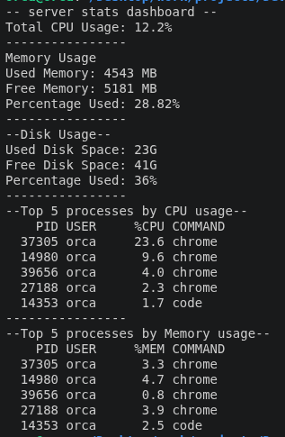

# server-performance-stats
# 📊 Server Performance Stats Tracker

A simple, lightweight Bash script to analyze server performance metrics in real time. This project is built using native Linux commands, meaning it works on any clean Linux server out of the box without installing heavy software.

---

## 🚀 How it Works (Under the Hood)

This script gathers data directly from the Linux operating system using built-in terminal tools:
* **CPU Usage:** Reads the system snapshot using `top`, finds the idle time, and subtracts it from 100% to calculate total usage.
* **RAM Memory:** Parses the `free -m` command to extract used memory, free memory, and calculate the consumption percentage.
* **Disk Storage:** Uses `df -h /` to check the main root hard drive folder space.
* **Processes:** Utilizes `ps -eo` to list, sort, and display the top 5 heaviest background programs.

---

## 📸 Dashboard Preview

Here is what the dashboard looks like when executed on an Ubuntu system:



---

## 🛠️ How to Setup and Run This Project

### 1. Clone the Repository
Open your terminal and download this project to your machine:
```bash
git clone https://github.com/AbdullahHAK/server-performance-stats
cd server-performance-stats
```

### 2. Give Execution Permission
By default, Linux blocks scripts from running for safety. Give it permission with this command:
```bash
chmod +x server_performance_stats.sh
```

### 3. Run the Script
Execute the script to see your live server dashboard:
```bash
./server_performance_stats.sh
```

---

